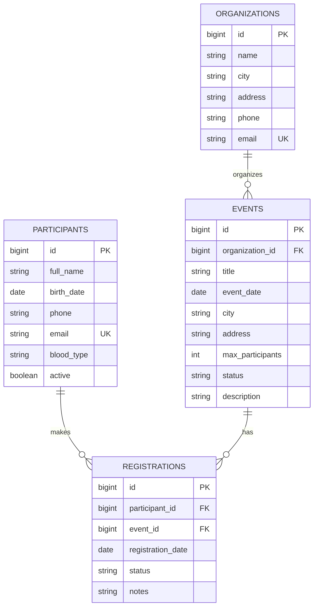

# ER-диаграмма

`organizations.id -> events.organization_id`, `participants.id -> registrations.participant_id` и
`events.id -> registrations.event_id` — внешние ключи связей 1:N. Участники и мероприятия имеют
отношение M:N через таблицу-связку `registrations`. Составное ограничение
`UNIQUE(participant_id, event_id)` запрещает повторную регистрацию.
